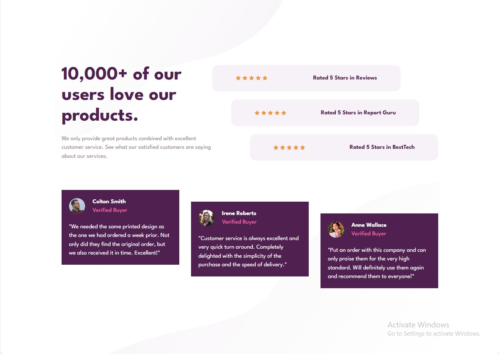

# Social Proof Section Component



A responsive social proof section featuring customer testimonials and interactive star ratings. Built with React and Tailwind CSS.

## ✨ Key Features

- **Interactive Star Ratings**: Clickable star rating system
- **Fully Responsive**: Optimized for all screen sizes
- **Performance Optimized**:
  - Lazy-loaded images
  - Efficient CSS with variables
- **Modern Design**: Clean UI with proper color contrast

## 🛠️ Technical Implementation

### Core Technologies

- React 18
- Tailwind CSS
- CSS Variables
- Responsive Design (mobile-first)

### Key Components

- `StarRating.jsx`: Interactive 5-star rating component
- `Posts.jsx`: Testimonial cards with hover effects
- `Heading.jsx`: Responsive header section
- `RateItem.jsx`: Rating display component

## 🚀 Getting Started

1. Clone the repository

```bash
https://github.com/AbdulrahmanFrontend/social-proof-section
```

2. Install dependencies:

```bash
npm install
```

3. Run the development server

```bash
npm run dev
```

## 📈 Future Improvements

- Add testimonial submission form

- Implement dark mode

- Add animation on scroll

- Connect to backend API for dynamic content

## 📜 License

[MIT](LICENSE) License - Free for personal and commercial use
