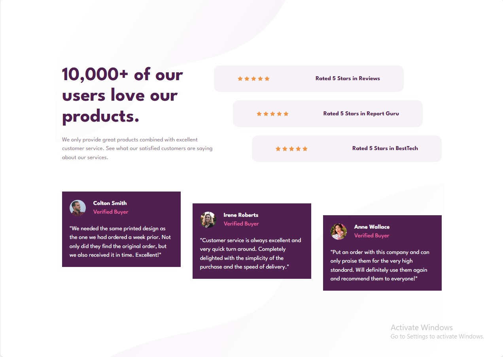

<div dir="rtl" style="text-align: right;">

# قسم إثبات اجتماعي



مكون تفاعلي لعرض تقييمات العملاء وشهاداتهم، مبني باستخدام React و Tailwind CSS.

## ✨ الميزات الرئيسية

- **نظام تقييم نجوم تفاعلي**: يمكن النقر على النجوم للتقييم
- **تأثيرات حركية**: تأثيرات عند تمرير المؤشر على البطاقات والتقييمات
- **تصميم متجاوب**: يعمل على جميع أحجام الشاشات
- **مُحسّن للأداء**:
  - تحميل متأخر للصور
  - أنماط CSS فعالة باستخدام المتغيرات
- **تصميم عصري**: واجهة نظيفة مع تباين ألوان مناسب

## 🛠️ التنفيذ الفني

### التقنيات الأساسية

- React 18
- Tailwind CSS
- متغيرات CSS
- تصميم متجاوب (mobile-first)

### المكونات الرئيسية

- `StarRating.jsx`: مكون تقييم النجوم التفاعلي
- `Posts.jsx`: بطاقات الشهادات مع تأثيرات حركية
- `Heading.jsx`: قسم العنوان المتجاوب
- `RateItem.jsx`: مكون عرض التقييمات

## 🚀 كيفية البدء

1. استنسخ المشروع

```bash
https://github.com/AbdulrahmanFrontend/social-proof-section
```

2. تثبيت المتطلبات:

```bash
npm install
```

3. تشغيل السيرفر المحلي:

```bash
npm run dev
```

## 📈 تحسينات مستقبلية مقترحة

- إضافة نموذج لإرسال شهادات جديدة

- دعم الوضع المظلم

- إضافة تأثيرات عند التمرير

- ربط مع واجهة برمجية لمحتوى ديناميكي

## 📜 الرخصة

رخصة [MIT](../LICENSE) - مجانية للاستخدام الشخصي والتجاري

</div>
